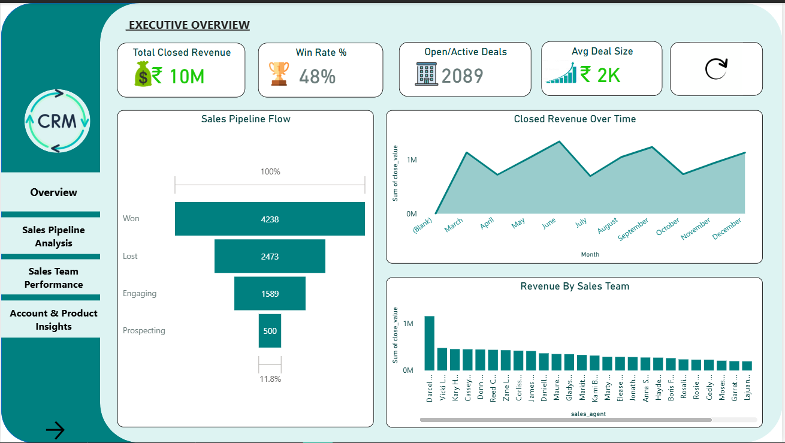
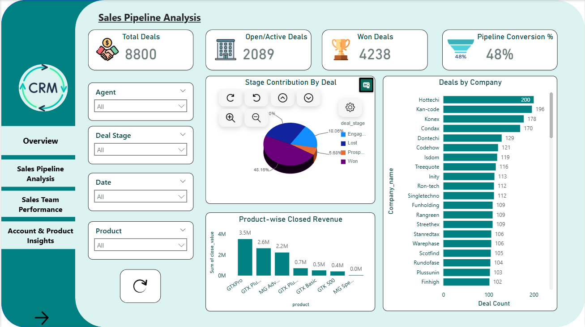
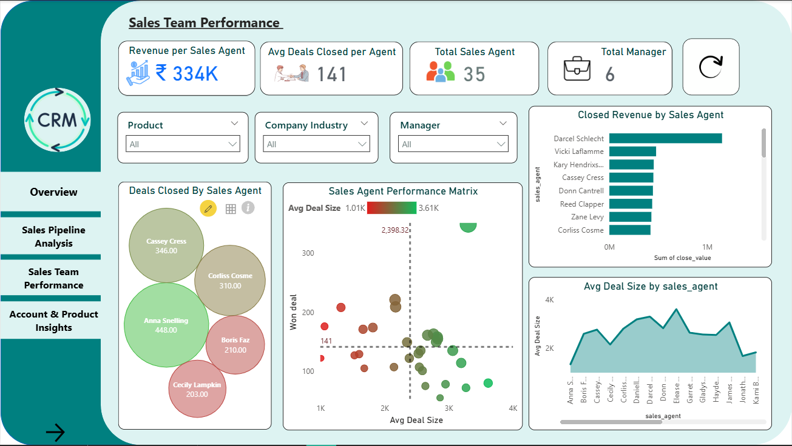
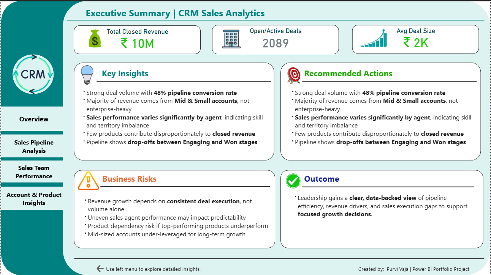

# 📊 CRM Sales Analytics – Power BI Project

End-to-end Power BI dashboard analyzing CRM sales data to track revenue, pipeline performance, and sales team efficiency.

---

## 📈 Dashboard Preview

### 🔹 Executive Overview

### 🔹 Sales Pipeline Analysis

### 🔹 Sales Team Performance

### 🔹 Account & Product Insights

### 🔹 Executive Summary

---

## 🎥 Demo Video
[Watch Dashboard Walkthrough](Final_BI_SR.mp4)

---

## 📂 Project Files
- [Power BI Final Project.pbix](Power BI Final Project.pbix) – Dashboard file  
- [Final_BI_SR.mp4](Final_BI_SR.mp4) – Demo video  

---

## 🛠 Tools & Concepts
- Power BI  
- DAX  
- Data Modeling (Star Schema)  
- KPI Tracking & Dashboard Design  

---

## 💡 Key Insights
- 48% pipeline conversion with noticeable drop between Engaging → Won stage  
- Mid-sized accounts contribute most to revenue  
- Clear performance gap across sales agents  
- Revenue concentrated in a few key products  

---

## 🚀 Outcome
Built an interactive dashboard to help track sales performance, identify bottlenecks, and support better business decisions.

---

## 🔗 Connect
GitHub: https://github.com/purvivaja  
LinkedIn: (add your link)
